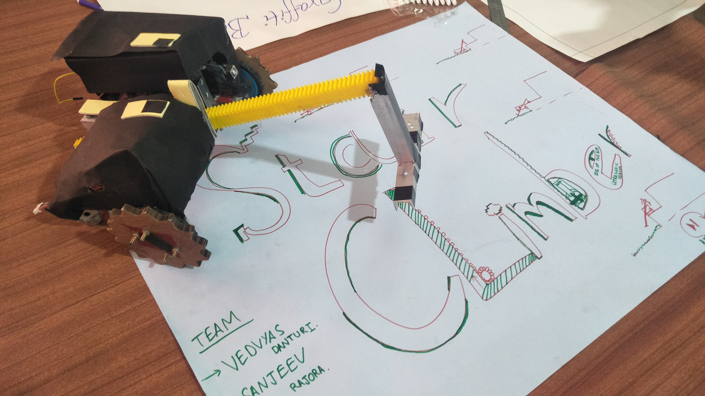

# Staircase-Climber

## AIM   
To make the bot climb the stair of various height by detecting it of its own. 
Basically Bot use rack and pinion to climb the stair.
## Final Model

## Algorithm  
Rack is attached to bot by a link and that link is connected to servo with which we can change the angle of rack according to height of the stair . pinion is connected to the main motor which has high torque to lift the weight of the bot up to stair.
To measure the distance of stair from bot we used sharp IR sensor .The values we are getting from sharp -IR  are fluctuating and give error upto 5 cm then we moved to ultrasonic sensor. We put moving average (filter) to get accurate distance .
Angle of the rack change accordingly, when rack reached to stair we start the main motor and make the rack to move down rack ,when rack strike  the floor  it makes the bot to move up by pushing the rack downward.
once the bot rechedd the next stair ,direction of main motor changes and make the  rack to move up to initial position.

### Rack
Rack is attached to the bot by a single link through hoke type linkage which is on the other hand connected to servo motor.

### Chasis 
Chasie is consist of two wheel differential with one caster wheel in back in total consisting of three wheel as three point are always pass through the plane.

### Problem faced  
While climbing up ,the weight of the whole bot is only on the rack which make the bot  tilt and sometime whole bot topple.
During climbing up when wheels touches the wall of the stair it pushes the bot backward and make it difficult for the bot to reach at the  step floor ,to solve this we attach star shaped wheel .
### Team members
1. Sanjeev 
2. Vedvyas danturi
### Mentor
1. Aayushi shrivastava
2. Bhavya giri goswami 
